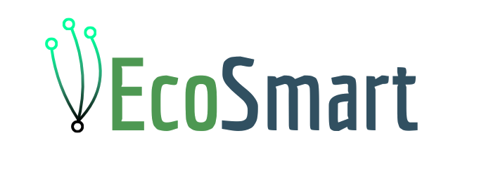

# Global Solution_1_semestre

  

> **Uma plataforma digital para monitoramento e redução do consumo de energia.**  
> Conecte-se ao futuro sustentável com tecnologia que recompensa escolhas conscientes.  

---

## ⚠️ **Problemática**  

🌍 O mundo enfrenta grandes desafios relacionados ao uso de energia:  
- O **crescimento populacional** e o **desenvolvimento econômico** aumentaram drasticamente a demanda energética.  
- Mesmo utilizando **energias renováveis**, como as hidrelétricas, os impactos ambientais ainda são significativos:  
  - **Poluição indireta:** desmatamento e perda de biodiversidade devido à infraestrutura de distribuição.  
  - **Consumo desenfreado:** a falsa sensação de que fontes renováveis permitem consumo sem limites.  

💡 *Esse cenário exige soluções que promovam um consumo mais consciente, ajudando a diminuir a necessidade de expansão energética e reduzindo os impactos ambientais.*

---

## 💡 **Descrição da Solução**  

*Para enfrentar esse desafio, surge a nossa proposta, um projeto inovador focado na conscientização e redução do consumo de energia.*

A **EcoSmart** promove o uso responsável de eletricidade através de uma plataforma digital, conectada a um medidor de energia no painel residencial. Os usuários poderão monitorar, em tempo real, o tempo de uso de aparelhos e iluminação, além de acumular pontos ao reduzir o consumo de energia. Esses pontos podem ser trocados por descontos em lojas parceiras, incentivando a adoção de ações mais conscientes e sustentáveis. 

A integração do site com o medidor permite que cada usuário visualize um histórico detalhado do consumo de energia, recebendo gráficos e relatórios personalizados para facilitar a análise do consumo ao longo do tempo. 
Ao incentivar o uso eficiente de energia, o EcoSmart promove o consumo consciente e apoia o crescimento econômico sustentável ao impulsionar parcerias com empresas. Dessa forma, o projeto não só facilita a economia doméstica para os usuários, mas também fomenta práticas de consumo que beneficiam tanto as pessoas quanto o meio ambiente, contribuindo para uma preservação ambiental que reflete em um futuro mais sustentável.

---
## 🎯 **Funcionalidades Principais**  

- 🔎 **Monitoramento em tempo real** do consumo de energia.  
- 🏅 **Recompensas** por redução no consumo.  
- 📈 **Relatórios gráficos** para análise detalhada.  
- 🛒 **Integração com lojas parceiras** para resgatar pontos.  

---
## 🗺 Roadmap - [Link do Trello](https://trello.com/invite/b/673363e88fe9d386151ce014/ATTI8e6d6f53746dfee3b1e9fe0e362550731DF8FD21/ecosmart-gs)
## 🖌 Figma - [Link do Figma](https://www.figma.com/design/Dl7lMdRpZJsvwBXYQa7Piy/EcoSmart?node-id=61-14&t=oFN0R9EuyMkDENXm-1)
# 👥 Team BGA

  

    
    <h3>Bruno Cantacini</h3>
    
RM: 560242

  
 

    
    <h3>Gustavo Gonçalves</h3>
    
RM: 556823

  
 

    
    <h3>Amanda Galdino</h3>
    
RM: 560066

  

